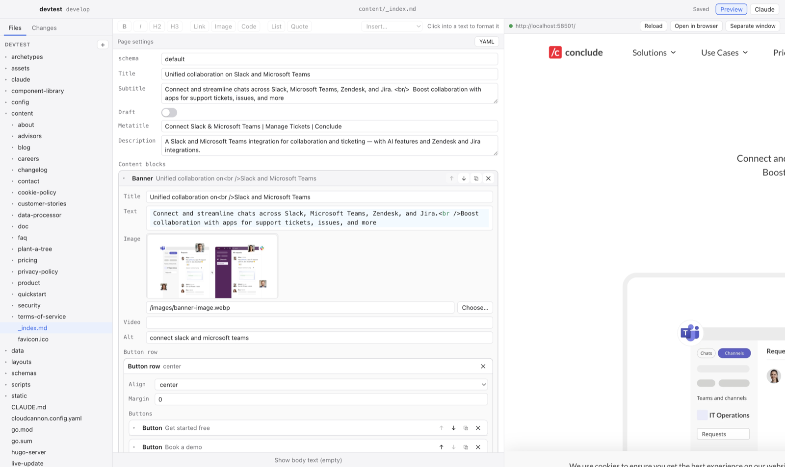

# Galley

Galley is a Mac app for editing the [conclude.io](https://conclude.io) website. It works on a
normal checkout of the site and puts everything in one window: the pages, a form for each
page's settings and content blocks, a markdown editor for prose, a live preview, Claude, and
the git steps needed to get a change reviewed.



## Installation

You need a Mac running macOS 12 or later and access to the `teamconclude` organisation on GitHub.

1. Open **Terminal**: press ⌘ Space, type `Terminal`, press Return.
2. Paste this line and press Return:

   ```sh
   curl -fsSL https://github.com/teamconclude/galley/releases/latest/download/install.sh | sh
   ```

   It downloads the latest Galley into Applications and opens it. Run the same line again
   any time to update by hand; Galley also updates itself.

3. On first start Galley shows what it is setting up. It downloads what the Mac lacks and
   asks for the two things only you can do:
   - **git** and **Hugo**, the site generator, are used from the Mac when installed, from
     Homebrew for example, and otherwise downloaded into Galley's own folder. Galley's own
     Hugo is refreshed weekly.
   - **Claude Code** is installed with its official installer. The first time the Claude
     pane opens it asks you to sign in.
   - **GitHub sign-in** shows a short code and opens github.com; enter the code there. That
     is what lets Galley fetch and push the site. Skip it if you use SSH keys with GitHub.
   - **The site checkout** is cloned into `~/Conclude/web` with one click, or you point
     Galley at an existing checkout.

   The Setup entry in the Galley menu shows this list again at any time.

If you prefer to install by hand, download the `.dmg` from the
[latest release](https://github.com/teamconclude/galley/releases/latest) and drag Galley to
Applications. Because the app is not yet signed with an Apple developer certificate, macOS
blocks the first start: close the warning, open System Settings › Privacy & Security, scroll
down and click **Open Anyway**. The Terminal line above avoids this, since macOS only checks
files that a browser downloaded.

## Using Galley

**Getting the site.** On first start, choose the folder where the site is checked out, or
pick **Clone** to get a fresh copy from GitHub. Galley remembers the checkout.

**Pages.** The left side lists the files of the site. The `content` folder holds the pages,
one markdown file each, grouped by section. The `+` button and the right-click menu create,
rename, duplicate and delete files. A new page copies the settings of the newest page in
the same folder, so it fits its section. Dropping images onto the tree or into a text puts
them under `static/images`.

**Editing.** A page opens as a form of its settings. Marketing pages are built from content
blocks, shown as cards that can be opened, reordered, duplicated and removed, with a menu to
add new ones. Text fields with formatting get a markdown editor and the toolbar at the top.
Images are chosen from the site's images or dropped in. **YAML** at the top right shows the
raw settings for the rare case the form does not cover something. Below the settings, **Show
body text** opens the page's prose. Everything is saved as you type.

**Preview.** The right side shows the page as it will look, updated after every change.
**Separate window** moves it out of the main window, for example to a second screen.

**Claude.** The Claude button opens Claude Code in the checkout. Ask it to draft a blog
post, rewrite a section, or find where something is on the site.

**Publishing.** The **Changes** tab lists what you changed and shows a diff for each file.
Work happens on a branch: the branch menu creates one, named after you. Write a short
message and **Commit** the selected files, then **Push**. When the branch is pushed,
**Open pull request** takes you to GitHub where the change is reviewed and merged to
`staging` and later `production`. Galley checks GitHub every few minutes and offers
**Pull** when a colleague added to your branch and **Update** when `staging` moved on.

## Development

Galley is an Electron app written in TypeScript with React, built with electron-vite. The
main process talks to git and Hugo and serves the checkout to the renderer, where CodeMirror
provides the editors and xterm.js the Claude pane.

```sh
npm install
npm run dev          # start with live reload
npm run typecheck
npm run lint
npm run build:unpack # packaged app in dist/mac-arm64, for trying the packaged behaviour
npm run build:mac    # .dmg and .zip in dist/
```

The page forms are generated from the component schemas in the site checkout,
`component-library/components/<name>/<name>.yml` (label, description and a `fields` map of
type, label, placeholder, help and default per key), or from `<name>.bookshop.yml` while a
site still uses Bookshop, with labels derived from the keys. Nothing in Galley needs to
change when a component is added.

### Releasing

A release is a tag. Tag the commit and push the tag:

```sh
git tag v0.2.0
git push origin v0.2.0
```

GitHub Actions builds the app with that version and publishes a release `v0.2.0` with the
DMG, the zip and `latest-mac.yml`, which installed copies read to find updates. The version
in package.json stays `0.0.0`; the workflow sets it from the tag.

Without an Apple developer certificate the build is signed ad hoc, which is why the first
install needs Open Anyway. Adding the `CSC_LINK`, `CSC_KEY_PASSWORD`, `APPLE_ID`,
`APPLE_APP_SPECIFIC_PASSWORD` and `APPLE_TEAM_ID` secrets to the repository turns on signing
and notarisation without further changes.

`GALLEY_UPDATE_FEED=<url>` points the updater at another folder holding `latest-mac.yml` and
the zip, to test updates against a local build.

### Testing on a fresh Mac

`GALLEY_FRESH=git,hugo,claude` makes a development build behave as if those tools were
missing, so the downloads run on a machine that has them. The real test is a fresh macOS
virtual machine with [tart](https://tart.run): create one with
`tart clone ghcr.io/cirruslabs/macos-sequoia-base:latest galley-test`, build the DMG, and
run `scripts/vm-test`. It installs the DMG in the VM, starts Galley, and copies a screenshot
and Galley's log (`~/Library/Logs/Galley/galley.log`) back into `dist/vm/`. `tart run
galley-test` opens the VM's screen to click through the setup by hand.

GitHub sign-in needs the client id of a GitHub OAuth app with the device flow enabled, set
as `builtInClientId` in `src/main/github.ts`; `GALLEY_GITHUB_CLIENT_ID` overrides it for
development. Without it the sign-in step is skipped and git relies on the Mac's own
credentials.

## License

BSD 3-Clause, see [LICENSE](LICENSE).
